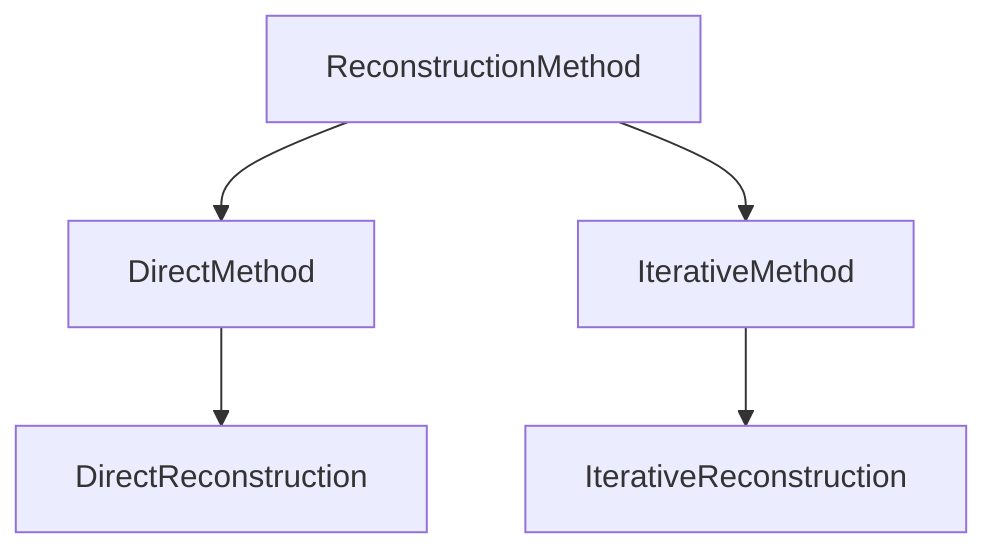

# Reconstruction Methods

*Tutorial: [Reconstruction methods](../tutorials/04_reconstruction_methods.md).*

`Ristretto` provides a unified method taxonomy rooted in `ReconstructionMethod`. Every reconstruction task is specified by passing a method object to `reconstruct`.

```julia
reconstruct(acq_data, method = DirectReconstruction(); kwargs...)
```

## Method Taxonomy



### Direct Reconstruction

`DirectReconstruction` performs non-iterative reconstruction (such as adjoint sensitivity combination $\mathcal{A}^* y$ or gridding).

```julia
DirectReconstruction(; coil_combination = AdjointSensitivity())
```

#### Coil Combination

- `AdjointSensitivity()`: Sensitivity-weighted multi-coil combination using sensitivity maps ($\sum_c S_c^* x_c$).
- `RootSumSquares()`: Root sum of squares across receive coils ($\sqrt{\sum_c |x_c|^2}$).
- `NoCoilCombination()`: Leaves separate coil images uncombined.

### Iterative Reconstruction

`IterativeReconstruction` configures regularized or unregularized iterative inverse problems.

```julia
IterativeReconstruction(
    regularization...;
    algorithm = DEFAULT_ALGORITHMS,
    fidelity = L2Loss(),
    signal_model = nothing,
    exact_opnorm = false,
    disable_operator_normalization = false,
    maxit = 100,
    reltol = 1e-4,
)
```

`maxit` and `reltol` are keyword-only, as is every other tuning parameter: regularization terms are
the only positional arguments. `reltol` is *relative*, hence the name — the absolute threshold given
to the solver is `max(10*eps, reltol * maximum(abs, x₀))`, unlike `ProximalAlgorithms`' absolute
`tol` on the algorithm object. Setting either to `nothing` defers to the `algorithm`'s own
value, which is how `algorithm = FISTA(maxit = 500)` becomes reachable.

#### Signal Models

The `signal_model` keyword sets how the optimization variable maps to the image:

- `nothing` (default): the variable *is* the image, $x \in \mathbb{C}^N$.
- `TemporalBasis(Φ; time_dim)`: the variable holds subspace coefficients that expand to a dynamic
  image series via $\Phi$.
- `KSpaceToImage(coil_combination = RootSumSquares())`: the variable is the full multi-channel
  k-space; the solve enforces data consistency with the subsampling operator only, and the result is
  transformed to an image (inverse FFT + coil combination) afterwards. Used by `SPIRiT(; iterative = true)`.

#### Data Fidelity Terms

- `L2Loss()`: Standard $\ell_2$-norm data fidelity $\frac{1}{2}\|\mathcal{A}x - y\|_2^2$. Used by default.
- `HardConsistency(; maxit = 50, tol = 1e-6)`: Hard data consistency constraint indicator $\{x \mid \mathcal{A}x = y\}$. When $\mathcal{A}\mathcal{A}^*$ is diagonal (single-coil Cartesian, or a `KSpaceToImage` signal model), the projection is computed directly in closed form. Otherwise, an inner Conjugate Gradient iteration is evaluated. Ideal for pairing with `DouglasRachford()` or POCS-style projections.
- `NoFidelity()`: Omits the data consistency term completely (useful for unconstrained optimization or custom models).

#### Solver Selection and Configuration

- `algorithm`: Solver algorithm (e.g., `FISTA()`, `ADMM()`, `DouglasRachford()`, `CG()`, `CGNR()`) or candidate tuple. Defaults to `DEFAULT_ALGORITHMS` (`(CG(), CGNR(), POGM(), ADMM(), DouglasRachford())`), where the appropriate solver is selected based on model convexity and smoothness.
- `exact_opnorm`: Compute $\|\mathcal{A}\|$ with a fully converged power iteration instead of
  `estimate_opnorm`. The estimate returns the upper end of a certified interval — a power
  iteration, which converges from below, paired with a closed-form upper bound — so it is a slight
  *over*-estimate, which costs convergence rate but never the safety of the step size.
- `disable_operator_normalization`: Skip the $\|\mathcal{A}\|$ estimate and let the algorithm derive
  its own step size. (The name predates the change described below — it no longer rescales
  $\mathcal{A}$, because nothing does.)

#### Operator norm, step size and λ

A proximal algorithm needs the Lipschitz constant of $\nabla f$, not an operator of unit norm, so
Ristretto estimates $L = \|\mathcal{A}\|$ and passes $L_f = n L^2$ as the step-size hint ($n$ = number of
optimization variables sharing $\mathcal{A}$; the data term is
$\tfrac12\|\mathcal{A}(x_1 + \dots + x_n) - y\|^2$, whose gradient has Lipschitz constant
$\|[\mathcal{A} \dots \mathcal{A}]\|^2 = n\|\mathcal{A}\|^2$). A smooth regularizer
([`L2Image`](@ref), [`EdgePreservingRoughness2D`](@ref)) is differentiated together with the data
term, so its own constant is added: $L_g\|K\|^2$ for a term $g(Kx)$ whose gradient $\nabla g$ is
$L_g$-Lipschitz. For the edge-preserving roughness that is $\lambda/\delta\,\|\nabla\|^2$, about
twenty times the data term's at the default $\delta$ on a unit-norm Cartesian operator; a step
that ignores it makes the iterates oscillate. The problem solved is

```math
\tfrac{1}{2}\|\mathcal{A}x - y\|_2^2 + \mathcal{R}(x)
```

so `λ` weights the regularizer against the data term directly, in the data's own units, and the
reconstructed image comes back in those units too.

!!! note "Why the encoding operator is not rescaled to unit norm"
    A common alternative is to normalize the operator and solve
    $\tfrac12\|(\mathcal{A}/L)x - y\|^2 + \mathcal{R}(x)$ with $L = \|\mathcal{A}\|$. Ristretto does not,
    because that quietly changes both of the quantities a user reads. Substituting $x = Lv$ turns
    it into $L^2\left[\tfrac12\|\mathcal{A}v - y\|^2 + L\,\lambda\|\Psi v\|_1\right]$ for a
    degree-one homogeneous regularizer: the weight actually applied is $\lambda L$, not $\lambda$,
    **and the returned image is $L$ times larger than the data's units** — exactly $L$ as
    $\lambda \to 0$ (measured: $\|x\|/\|x_\text{true}\| = 1.5214$ against $L = 1.5214$). An
    amplitude-aligned NRMSE hides both effects, which is why this is easy to miss.

    $L$ is insensitive to matrix size and undersampling factor, but it scales linearly with the
    sensitivity maps' own scaling and varies with coil count (measured on a 128² brain phantom:
    $L = 1.5250$ with 8 coils, $1.0872$ with 4). Solving the unscaled problem is what keeps `λ`
    independent of how the coil sensitivities happen to be normalized. A `λ` tuned against a
    toolbox that does normalize reproduces the same solution here as `λ * L`, with
    $L = $ `AbstractOperators.estimate_opnorm(𝒜)` (and the image comes back $L$ times smaller,
    i.e. in the data's units).

The default warm start is one Landweber step, $x_0 = \mathcal{A}^*y/L^2$, rather than the bare
adjoint $\mathcal{A}^*y$: the adjoint alone is only on the image's scale when
$\mathcal{A}^*\mathcal{A} \approx I$, which holds for an orthonormal Cartesian FFT but not for an
uncompensated non-Cartesian (e.g. radial NFFT) operator, where $\mathcal{A}^*y$ can be off by
several orders of magnitude and a finite-`maxit`/`reltol` solve never fully corrects it — CG-SENSE is
the case that motivated this: run on radial data, it used to be *worse* than the plain adjoint.
For every proximal algorithm this reuses the same $L$ computed above at no extra cost. A pure
unregularized CG/CGNR solve does not otherwise need $L$ (it derives its own step size), and there
the warm start is scaled by a one-application stand-in instead — the Rayleigh quotient
$\langle x_0, \mathcal{A}^*\mathcal{A}x_0\rangle / \langle x_0, x_0\rangle$, which estimates the
same $\rho(\mathcal{A}^*\mathcal{A})$ the power method converges to, and is close precisely
because $x_0 = \mathcal{A}^*y$ already lies in the dominant subspace. Measured on a 192²×8
acquisition: 11 ms instead of 118 ms (Cartesian, R = 3) and 62 ms instead of 812 ms (radial, 80
spokes), landing 0.4 % and 3.2 % under the power estimate, which takes a 30-iteration CG-SENSE
solve from 0.448 s to 0.253 s and from 2.73 s to 1.82 s at unchanged NRMSE. A few per cent is
immaterial for a scale correction, where an order of magnitude is what matters; a step-size hint
that is too small is not, which is why the power method still runs wherever $L$ *is* the step size.
Either way the correction is skipped (keeping the bare adjoint) only when
`disable_operator_normalization = true` is passed explicitly.

ADMM has no step size, but its penalty $\rho$ plays the same part: the $x$-update solves
$(\mathcal{A}^*\mathcal{A} + \rho B^*B)\,x = \dots$, so $\rho$ only means something next to
$\|\mathcal{A}\|^2$. That is about 1 for a Cartesian encoding and about $2\cdot10^6$ for a radial
NFFT one, so a `rho` given to [`ADMM`](@ref "Alternating Direction Method of Multipliers (ADMM)") is taken **relative to** $\|\mathcal{A}\|^2$ and
multiplied by it (the Rayleigh quotient above, or $L^2$ where $L$ was estimated); the initial
`rho` of a `penalty_sequence` is treated the same way. An absolute penalty tuned on Cartesian data
is seven orders of magnitude too small for radial data: $\rho/\|\mathcal{A}\|^2$ falls below
`Float32` rounding, the proximal steps never reach $x$, and the image stops depending on `λ`
(measured on radial cine with a low-rank prior: bit-identical images for `λ` from $10^{-4}$ to 1).
This is the same as solving the normalized problem $\mathcal{A}/L$, $y/L$ with the data scaling
recomputed — which leaves the effective `λ` unchanged — and measured the same to four digits of
NRMSE, radial and Cartesian, at every `λ` tried. ADMM's default adaptive penalty, used when no
`rho` is given, starts from 1 and adapts to the problem's scale by itself; starting it from
$\|\mathcal{A}\|^2$ measured no better, so it is left alone. `disable_operator_normalization = true`
also leaves a given `rho` as it is.

#### Signal Models (`ℳ`)

Signal models map low-dimensional subspace or parameter representations to dynamic/multi-contrast image series $\mathcal{M}: \mathbb{C}^K \to \mathbb{C}^{N_{\text{frames}}}$, composing with the physical encoding operator as $\mathcal{A}_{\text{eff}} = \mathcal{A} \mathcal{M}$.

- `TemporalBasis(Φ; time_dim = :time)`: Subspace reconstruction with basis matrix $\Phi \in \mathbb{C}^{N_t \times K}$. The optimization variable is the coefficient array $c \in \mathbb{C}^{N_x \times N_y \times K}$, and the final reconstructed image is $x(r, t) = \sum_{k=1}^K \Phi(t, k) c(r, k)$.

$\Phi$ is computed beforehand — from Bloch simulations of the expected signal evolutions or an SVD
of a signal dictionary — so the problem stays linear and convex while the unknowns drop from $N_t$
to $K \ll N_t$ images per voxel: the partially separable model of Liang (2007), and the
"T2 shuffling" of Tamir et al. (2017) (BART's `pics -B`). `TemporalBasis` couples the time
dimension, so [Task Splitting](task_splitting.md) never splits over it.

```@docs
TemporalBasis
build_encoding_operator
signal_model_operator
```

### Partial Fourier Reconstruction

Partial Fourier techniques recover high-resolution images from asymmetrically sampled k-space data by exploiting conjugate phase symmetry.

The k-space of a *real* image is Hermitian, $S(-k) = S^*(k)$, so slightly more than half of it
along one phase-encoding direction determines the rest once the image phase is known. All three
methods estimate a smooth phase $\phi_c$ per coil from the symmetric band around the centre
([`partial_fourier_band`](@ref)) and differ in how they use it:

- [`Homodyne`](@ref) (Noll et al. 1991) weights k-space with an asymmetric ramp, demodulates by
  $e^{-i\phi_c}$ and keeps the real part. Non-iterative and fast, but it discards any phase beyond
  $\phi_c$, so it is the most sensitive of the three to rapid phase variation.
- [`PhaseConstrained`](@ref) (Margosian et al. 1986) solves the least-squares problem for a
  real-valued image $m$, $\min_{m \in \mathbb{R}} \tfrac12\sum_c\|\mathcal{P}\mathcal{F}(s_c e^{i\phi_c} m) - y_c\|_2^2$,
  by conjugate gradients on the normal equations.
- [`POCS`](@ref) (Haacke et al. 1991) alternates projections onto the set with phase $\phi_c$ in
  image space and onto consistency with the *acquired* samples in k-space.

```@docs
partial_fourier_band
PartialFourierFilter
LinearRamp
StepRamp
Homodyne
PhaseConstrained
POCS
```

### Parallel Imaging Methods

In addition to iterative SENSE models (`IterativeReconstruction`), `Ristretto` provides direct k-space autocalibrated parallel imaging:

- [`GRAPPA`](@ref) (Griswold et al. 2002) synthesizes each missing k-space line as a linear
  combination of acquired neighbours across all coils, with kernel weights fitted by least squares
  on the fully sampled autocalibration (ACS) block. With the default `RootSumSquares()`
  combination it needs no sensitivity maps.
- [`SPIRiT`](@ref) (Lustig & Pauly 2010) instead requires every k-space sample — acquired or not —
  to be consistent with its calibrated neighbourhood, $k = Gk$, and solves for the missing samples
  under that constraint. `iterative = true` states it as an [`IterativeReconstruction`](@ref) over
  the k-space ([`KSpaceToImage`](@ref)) with a [`SPIRiTConsistency`](@ref) term and
  [`HardConsistency`](@ref).
- Calibrationless k-space methods (SAKE, LORAKS) are a regularizer rather than a method here:
  [`StructuredLowRank`](@ref).

```@docs
GRAPPA
SPIRiT
SPIRiTConsistency
```

!!! note "What GRAPPA needs from the sampling pattern"
    GRAPPA fits one kernel per missing-line offset `t = 1 … R-1` and applies it everywhere, so it
    requires a *regular* phase-encoding pattern: a fixed stride $R$, fully sampled readout lines,
    and a contiguous ACS block long enough for the kernel. `check_applicable(GRAPPA(), acq)` — which
    `reconstruct` calls for you — rejects everything else, including the random and
    variable-density masks used for compressed sensing. There is no GRAPPA kernel for an irregular
    pattern; use `IterativeReconstruction` (CG-SENSE, optionally regularized) instead.

    `SPIRiT` has no such restriction: its consistency operator acts on the whole multi-channel
    k-space at once, so it also runs on irregular patterns — it only needs a fully sampled central
    region large enough to calibrate `kernel_size` on.

### Method, Signal-Model, Fidelity and Coil-Combination Types

[`DirectReconstruction`](@ref) and [`IterativeReconstruction`](@ref) are documented on the
[Reconstruction](reconstruction.md) page.

```@docs
KSpaceToImage
CoilCombination
AdjointSensitivity
RootSumSquares
NoCoilCombination
DataFidelity
L2Loss
HardConsistency
NoFidelity
```

## Method Extension Interface

A custom reconstruction method subtypes `IterativeMethod` or `DirectMethod` and may
override one interface hook:

- `check_applicable(method, acq_data)`: Validates that the method is compatible with the acquisition data.

The remaining hooks the package uses internally to lower a method and to size the optimization
variable (`lower`, `variable_dims`, `variable_size`, `output_dims`) are not part of the public API:
they are only ever overridden along the closed signal-model axis, which is not an extension point.

The encoding operator a method lowers to is built by an internal hook that dispatches on the
method's signal model:

```@docs
Ristretto.model_encoding_operator
```

## References

Parallel imaging:
- Griswold, M. A., et al. (2002). *Generalized autocalibrating partially parallel acquisitions (GRAPPA).* Magnetic Resonance in Medicine, 47(6), 1202-1210. <https://doi.org/10.1002/mrm.10171> — [`GRAPPA`](@ref).
- Lustig, M., & Pauly, J. M. (2010). *SPIRiT: Iterative self-consistent parallel imaging reconstruction from arbitrary k-space.* Magnetic Resonance in Medicine, 64(2), 457-471. <https://doi.org/10.1002/mrm.22428> — [`SPIRiT`](@ref), [`SPIRiTConsistency`](@ref).

Partial Fourier:
- Margosian, P., Schmitt, F., & Purdy, D. (1986). *Faster MR imaging: Imaging with half the data.* Health Care Instrumentation, 1(6), 195-197. — [`PhaseConstrained`](@ref).
- Noll, D. C., Nishimura, D. G., & Macovski, A. (1991). *Homodyne detection in magnetic resonance imaging.* IEEE Transactions on Medical Imaging, 10(2), 154-163. <https://doi.org/10.1109/42.79473> — [`Homodyne`](@ref).
- Haacke, E. M., Lindskog, E. D., & Lin, W. (1991). *A fast, iterative, partial-Fourier technique capable of local phase recovery.* Journal of Magnetic Resonance, 92(1), 126-145. <https://doi.org/10.1016/0022-2364(91)90253-P> — [`POCS`](@ref).

Subspace reconstruction:
- Liang, Z.-P. (2007). *Spatiotemporal imaging with partially separable functions.* Proc. IEEE ISBI, 988-991. <https://doi.org/10.1109/ISBI.2007.357020> — [`TemporalBasis`](@ref).
- Tamir, J. I., et al. (2017). *T2 shuffling: Sharp, multicontrast, volumetric fast spin-echo imaging.* Magnetic Resonance in Medicine, 77(1), 180-195. <https://doi.org/10.1002/mrm.26102>
